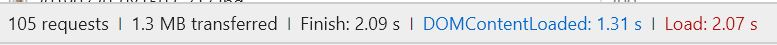

# Task-1

## **Analysis of The Home Page Loading of SJTU and Compare with Three Other Universities**

### **Loading Summary** and **Details** of Four Universities (Chrome)

#### Network

* **SJTU**

* **Tsinghua University** (THU)

* **Fudan University** (FDU)

* **Tongji University** (TJU)

#### Performance

* **SJTU**

* **THU**

* **FDU**

* **TJU**

### **Analysis** - Why the Home Page Loading of SJTU Is Much Slower

**Many files need to be loaded**

*e.g.*  Many css, js files and images needed to be loaded from server and it takes much time.

But other home pages load less files or load these files from memory cache or disk memory.

* **SJTU**

* **THU**

less css and js files

load from memory cache

### **Optimization Solution**

1. Combine scripts and stylesheets to reduce HTTP requests.

2. Use memory cache

3. Compress the files (img, css etc.)

### Home Page

[SJTU](https://www.sjtu.edu.cn/)

[THU](http://www.tsinghua.edu.cn/publish/thu2018/index.html)

[FDU](http://www.fudan.edu.cn/mindex.html)

[TJU](https://www.tongji.edu.cn/)

### Reference

[Chrome开发者工具详解(2)-Network面板](https://www.cnblogs.com/LibraThinker/p/5981346.html)

[全新Chrome Devtools Performance使用指南](https://blog.csdn.net/hualusiyu/article/details/78616468)

[DOMContentLoaded 与 Load 区别](https://www.cnblogs.com/caizhenbo/p/6679478.html)

[from memory cache与from disk cache](https://www.jianshu.com/p/8332da83955d)

[前端提升页面加载速度](https://blog.csdn.net/qiqi_77_/article/details/79423111)