# Dockerized REST service of Homeword II

## 将程序打包

```mvn clear package```

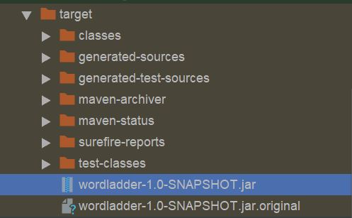

打包好的 **.jar* 文件在 *target* 目录下

## 写 Dockerfile

将 Dockerfile 和 wordladder-1.0-SNAPSHOT.jar 放在同一目录下(./docker)

Dockerfile 内容

```Dockerfile
FROM java:8

MAINTAINER yangxh99

ADD wordladder-1.0-SNAPSHOT.jar app.jar

EXPOSE 80

ENTRYPOINT ["java","-jar","/app.jar"]
```

## 安装 Docker Toolbox

> Docker Toolbox provides a way to use Docker on Windows systems that do not meet minimal system requirements for the Docker Desktop for Windows app.

Download [Docker Toolbox](https://github.com/docker/toolbox/releases) from github

安装成功后，**以管理员身份**运行 Docker QuickStart

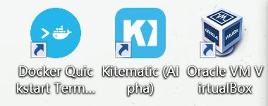

> The terminal does several things to set up Docker Toolbox for you. When it is done, the terminal displays the $ prompt.

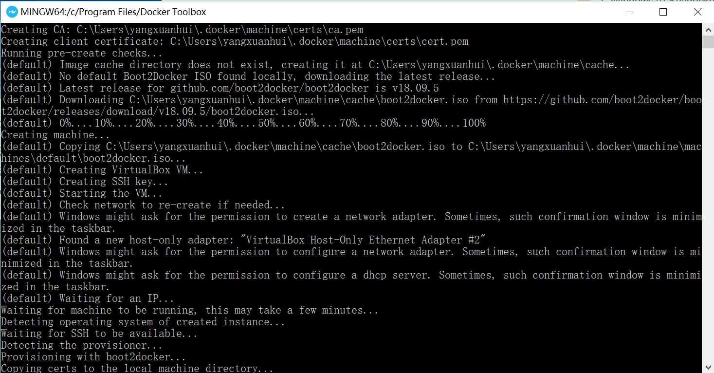

成功打开 terminal

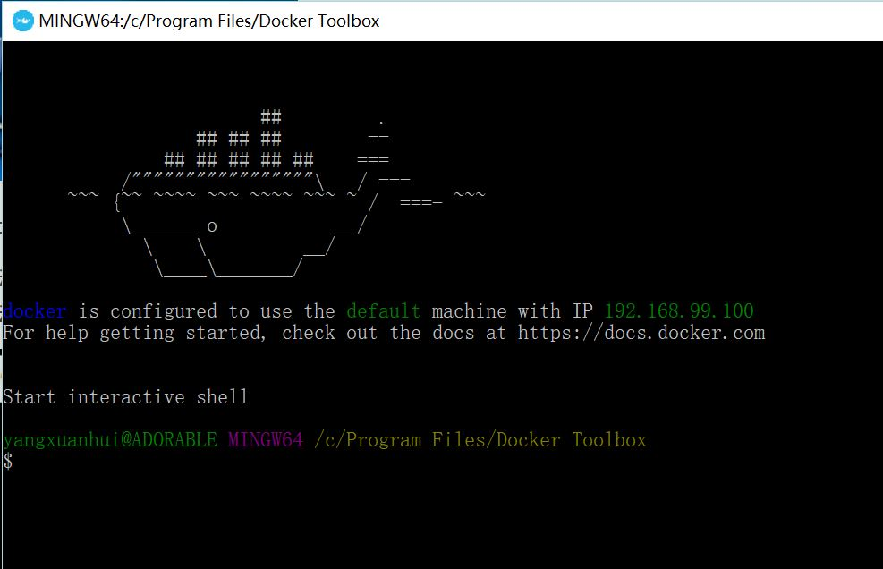

## 登录

```docker login```

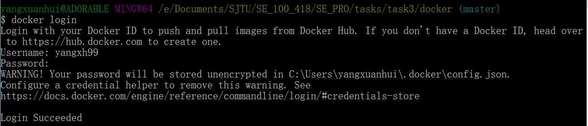

## 构建容器镜像 (container image) 并将其推送到Docker Hub

1. 运行命令
   ```docker build -t  yangxh99/wordladder .``` 来创建image

   ```yangxh99/wordladder```  ==> ```<your_username>/my-first-repo```

   ```.``` 是指明Dockerfile就在当前路径下

    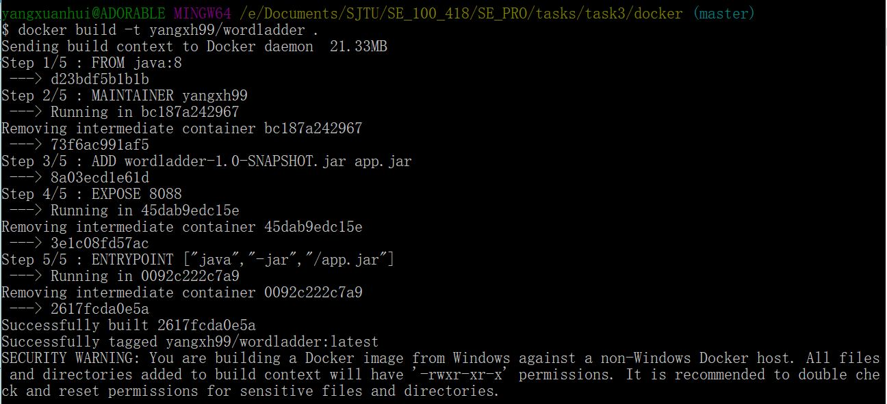

    可以通过 ```docker images``` 查看

    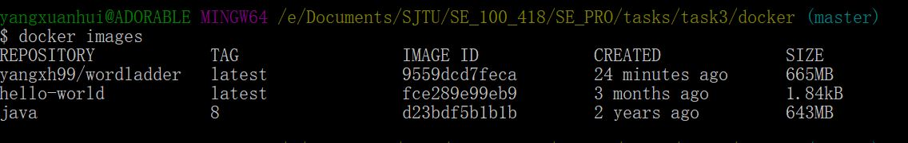

2. 运行镜像

    ```docker run yangxh99/wordladder```

    ```docker run -d -p 80:80 yangxh99/wordladder```

    ```-d``` 表示在后台运行，    ```-p``` 端口映射，格式为：主机(宿主)端口:容器端口

    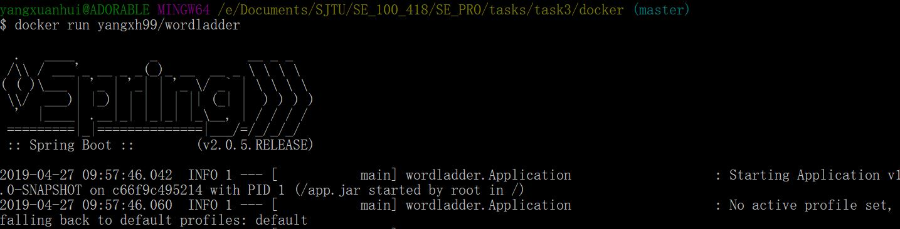

3. push 到 Docker Hub

    ```docker push yangxh99/wordladder```

    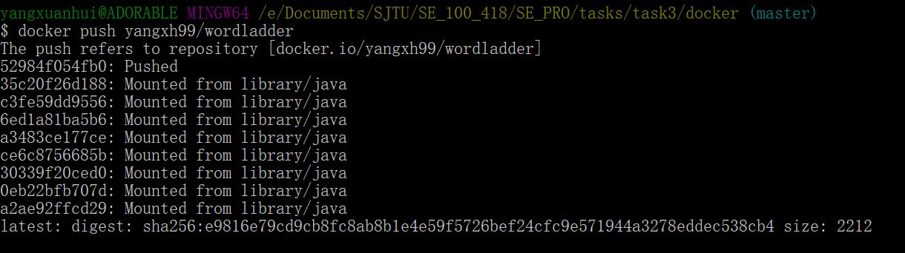

    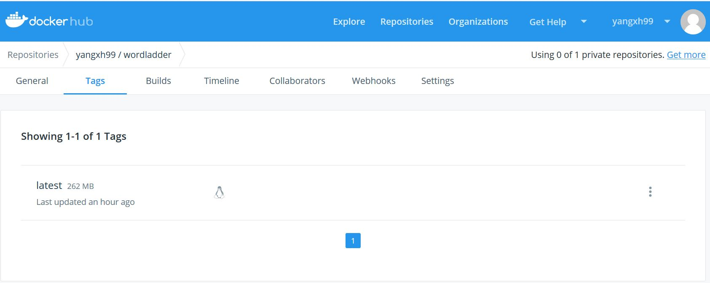

## 从Docker Hub上把镜像pull到本地

```docker pull yangxh99/wordladder```

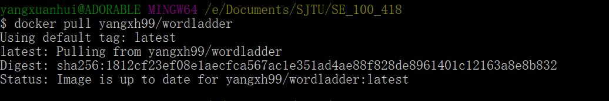

## Docker exec 命令

语法

```docker exec [OPTIONS] CONTAINER COMMAND [ARG...]```

可以在运行的容器中执行命令

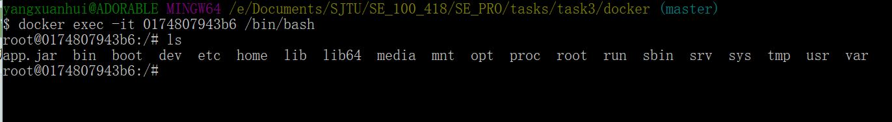

## 其他可能用到的指令

```docker ps``` 查看已经在运行的容器

```docker stop CONTAINER-ID``` 使运行的container停止，CONTAINER-ID 为想要停止的container的ID

```docker rm CONTAINER-ID``` 删除container

```docker rmi IMAGE-ID``` 删除镜像

## Reference

[Docker Hub Quickstart-官网](https://docs.docker.com/docker-hub/)

[Install Docker Toolbox on Windows-官网](https://docs.docker.com/toolbox/toolbox_install_windows/)

[Docker发布应用（2）](https://www.jianshu.com/p/d05642c32929)

[Docker exec 命令](https://www.runoob.com/docker/docker-exec-command.html)