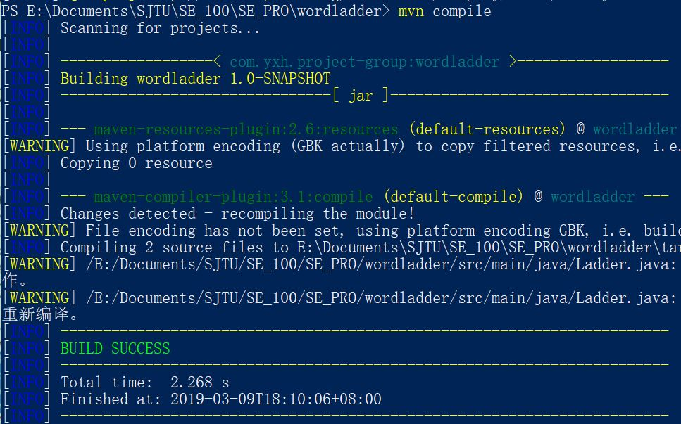
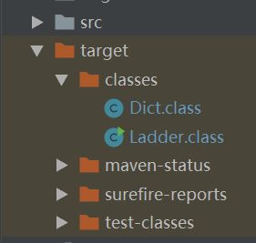
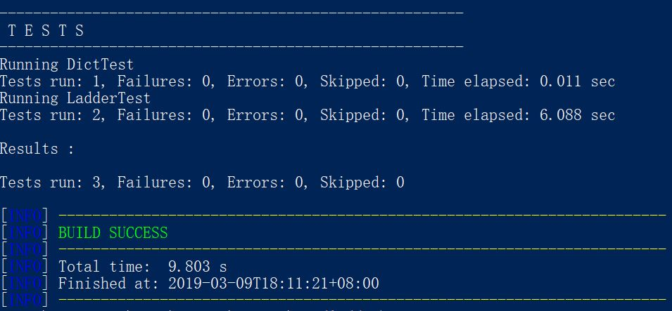
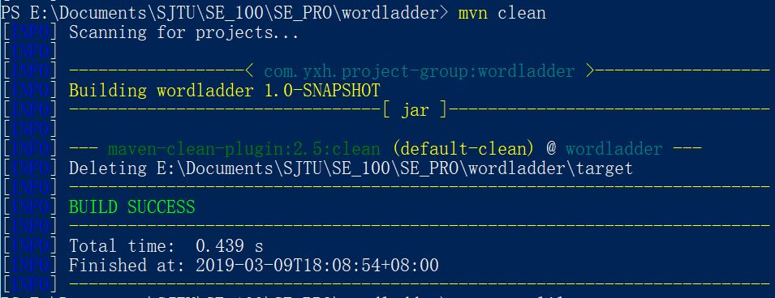
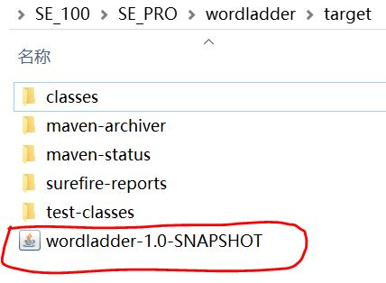
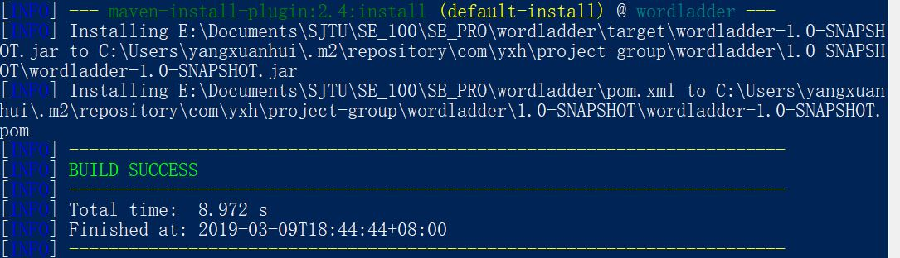
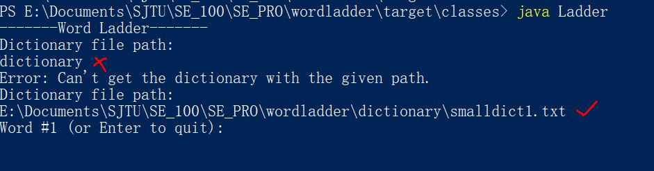
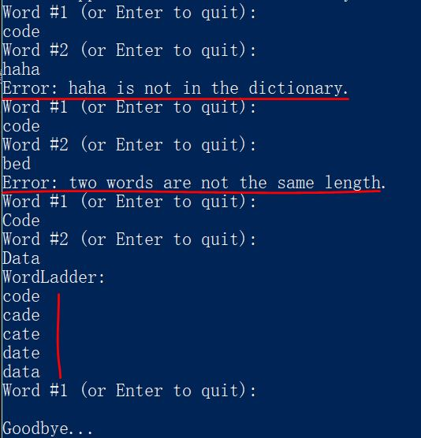

# User Guideline of Word Ladder

## Compile

命令行输入

> `mvn compile`

生成class文件，存在target目录下

## Test

> `mvn test`

执行src/test/java下单元测试类

## Clean

命令行输入

> `mvn clean`

clean是maven工程的清理命令，执行 clean会删除target目录及内容

## Package

package是maven工程的打包命令，对于java工程执行package打成jar包

> `mvn package`

## Install

> `mvn install`

将maven打成jar包或war包发布到本地仓库。

## Run Ladder

* 运行Ladder后首先输入要读取的字典的地址

* 输入开始和结束的单词（输错会重新开始）

